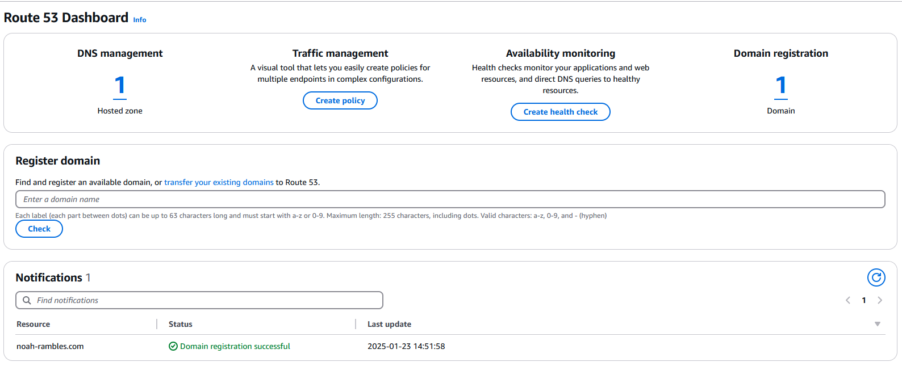

Pick from one of the three options above to view the different versions of the post!

 

# TECHNICAL

This version of the post will be a deep dive into the tech stack.  I'll do my best to explain the reasoning I had for various choices, and go into detail on some of the difficulties I came across getting it to work.

## The Idea

Cybersecurity blogs have, at least in my mind, taken off recently.  More and more I see [Medium](https://medium.com/) as a suggested result when looking things up.  These results are, almost always, awful.  Poorly written and containing a lot of false information, I decided very early on that I did not want to use Medium as my platform when I eventually got around to setting this blog up.

So, instead, I took it upon myself to host the blog on AWS instead.  I chose AWS as I'm most familiar with it, having created a website before.  Hosting a site on AWS is not as simple as I'm making it sound.  Below you can see a not-so-great drawing of the AWS services I'm using.

## S3 or Amplify

AWS offers two different options for creating a website hosted on their platform.  S3 (essentially a plain storage space in the cloud that you can allow access to), and Amplify (a fancier method of hosting more complicated sites).

One of the most important things I wanted to do when starting with this project was to keep it simple.  A common concept in Cybersecurity is that risk scales with attack surface, meaning that the more complicated you make something, the more risky it is.

So, with that in mind I opted for a static website with a simple tech stack.  Rather than code an entire blog framework by hand, I chose to use a static-site generator.  You can read a more detailed explanation [here](https://www.cloudflare.com/learning/performance/static-site-generator/), but the gist of it is that a static-site-generator will generate a complete static html based website using templates and raw data (in this case markdown).

More on the static website in a moment.  After deciding on the static site, it became clear that I should host the site on AWS S3.

## Setting up the S3 Buckets

S3 is fairly simple on the surface, you create what Amazon refers to as "buckets", these buckets can act much like a shared network directory you might have at work, except of course it's hosted in the cloud.  It becomes complicated when you open it up to the public Internet, something that is required to host a basic site on AWS.

Before getting into the security issues the above statement presents, I set up multiple buckets.  Two for my root and subdomain, and one to store logs forwarded by another service I'll mention shortly called CloudFront.  

Now, hosting a cybersecurity blog and allowing public access to the website code (even if it is static), didn't appeal to me.  On top of that, I wanted to have my own domain name rather than using a link to the bucket (something like http://websitename.com.s3-website-us-east-1.amazonaws.com).  Security-minded folks might have also noticed that the link is in plain old http, another concern I had with this method.

You are able to get around the above issues by tacking on two other AWS services:  Route 53 and CloudFront.

## Route 53

AWS Route 53 is Amazon's domain registration and DNS service.  It allows you to search for, purchase, and configure a domain.  In addition, you can set up DNS records that will propagate around the world in seconds, allowing you to associate the long AWS links like the one above, with the shorter domain name that you purchase.

I purchased the domain name for $14/year, and configured DNS records for both my root and subdomains to route to my CloudFront configuration.  Below is a screenshot of my Route 53 setup:

## CloudFront

CloudFront is something known as a CDN (Content Delivery Network).  Essentially, CDN's host a copy of your website at various locations around the globe.  Somebody in Europe will be able to access a cached copy of the site on a European server, significantly reducing latency, and providing a barrier between the user and the website itself.

I configured CloudFront to do just that, while also enforcing that users view the website using HTTPS, automatically upgrading anybody that attempted to view it in plain HTTP.

 

# New Blog Who Dis

In a lot of job applications I've been going through for the past...oh four years now or so, there's usually a little field where you can put a personal website.

Well that's a lot of work, who would do that? Me I guess!

I'll be using this blog to post some of my personal projects, maybe some info about things I'm learning or testing that kinda thing.

## Who Cares, How'd You Do It?

In a lot of job applications I've been going through for the past...oh four years now or so, there's usually a little field where you can put a personal website.

Well that's a lot of work, who would do that? Me I guess!

I'll be using this blog to post some of my personal projects, maybe some info about things I'm learning or testing that kinda thing.

## Who Cares, How'd You Do It?

Well that was rude, but also thanks for asking.

I've messed around with self-hosting websites on AWS before, and thought it would demonstrate my abilities a little if I did again with this blog thing. I've seen other cyber people use Medium but was a little put off with the vibe of that whole thing so thought I'd just try this out.

### AWS Route 53

So, I registered the domain name via AWS Route 53 which is also responsible for making sure DNS records are updated. I was a little concerned about whois lookups exposing some personal info, but AWS offers a privacy option which obfuscates all that.

Cost-wise it's not too bad, $14 a year and it does what I needed.

### Whoops

I got the domain name, kinda neglected to make the website. That's where [Astro](https://astro.build/) comes in! I've built sites by hand in the past, barebones html/css/javascript/php without any sort of templates or anything, and saying I didn't want to do that again was an understatement.

I'm definitely not a web dev type of guy, there's a level of artistic ability involved that I'm just completely lacking. The thought of "how can I make this look like it wasn't made by a color-blind geriatric monkey" went through my head a lot while researching.

#### TODO: Insert horrifying AI generated image of a geriatric color-blind monkey.

#### TODO: Figure out how to add comments in markdown.

It turns out that there's been some developments in webdev since the late 80s, who could've guessed?

Knowing that I wanted something simple (for security and sanity's sake), and something that looked nice (for the reader's sake), I settled on using a static-site generator framework.

### Static-Site What?

The long-standing idea that everything cool gets ruined by popularity is true 100-fold for the Internet.

I've got a background in cybersecurity, and an important concept to understand is how risk scales with attack surface. Having an overly bloated hand-jammed website filled with a bunch of features means vulnerabilities, and vulnerabilities mean your precious Bored Ape NFT collection is now public domain.

Static-site generators hide all of that bloated mess behind the scenes, allowing you to create and generate a simple html website using templates and markdown.

Essentially it saved me from ending up in this scenario:

Astro is neat, you can do some cool stuff. I borrowed [this](https://github.com/satnaing/astro-paper) template cause I thought it was also neat. A few hours later and I've got a basic site...on my computer. Can you all check out my site at localhost:4321?

### Git Ye Gone and Cloud Woes

Cool so to recap:

- [x] Domain Name
- [x] Site
- [ ] Literally Everything Else

Well, I started with getting Github set up which was easy enough.  The project can be found [here](https://github.com/noah344/noah-rambles).  I did this for reasons I'll explain later!

Now, setting up a static webpage is fairly easy, if you aren't worried about security.  It's as simple as creating an AWS S3 bucket, tossing your site up there, and allowing public access!

The concern there is that this would list the site in plain ol' HTTP, and seeing as this is supposed to be showing how proficient I am, I figured that would be a bad idea.

The solution to this is to use a combination of AWS CloudFront, Route53 DNS Alias records, and roughly 6 hours of troubleshooting.  That last part is key.

CloudFront is what's known as a CDN or Content Delivery Network.  It essentially hosts cached versions of content on servers across the world, allowing for faster access to the resources instead of them having to wait for data to travel all the way to them.

Side note, you can tell I spent 6 hours troubleshooting cause my writing is getting lazy and bad!

CloudFront also happens to be able to take HTTP requests, and force them to be HTTPS requests AND it can stop you from having to make your S3 buckets publicly available, a couple extra nice security features that I really wanted to get setup.

The problem here starts when you follow three different guides provided by AWS, each one adding an additional layer of security in ways that completely invalidate the last guide you followed:  [1](https://docs.aws.amazon.com/AmazonS3/latest/userguide/HostingWebsiteOnS3Setup.html), [2](https://docs.aws.amazon.com/AmazonS3/latest/userguide/website-hosting-custom-domain-walkthrough.html), [3](https://docs.aws.amazon.com/Route53/latest/DeveloperGuide/getting-started-cloudfront-overview.html).

On top of that, I swear that the AWS documentation was wrong in one spot, but I'm far too over it to try to figure out where.  Anyways, I found the age-old single tiny thing that was causing problems and I was finally able to set up the website with HTTPS over the Internet!  There's a lot more boring detail in there, but who wants to read about all that.

### Git Ye Gone Again?

Ok, so now the reason I pushed the site up to Github instead of just moving it to AWS by hand (aside from that being an insane thing to do).  Github has "Actions" that allow you to automate some processes when a user-specified event occurs.

In this case, I setup an action that would deploy the Astro project, generate the HTML, and then deploy it out to my AWS S3 bucket!  This means that any time I publich a new post, it will automatically get pushed out to the website which is, say it with me, pretty neat!

So that's the end of my first post!  I have a few projects I want to do that I'll do some writeups for, hopefully that wasn't too dull of a read.  I'm gonna commit this change and push it up, fingers crossed it actually updates!

