In this post I go over how I setup a Honeypot!  It was fairly easy, and I've already detected a few attacks!

Pick from one of the three options above to view the different versions of the post!

<div id="technical" style="display: none"> 

# TECHNICAL

For those that don't know, a Honeypot is system that is presented to the open Internet as vulnerable with the intent of monitoring and researching various different types of attacks.  There are plenty of different ways to get this going, and it's a project I've wanted to do for quite a while now.  After seeing an email exchange on the SANS Advisory Board, I started looking into SANS' own Honeypot they developed.

The [DShield Honeypot](https://isc.sans.edu/honeypot.html) was developed to assist SANS' Internet Storm Center (ISC) in gathering data about the state of the Internet as a whole.  They collect a lot of interesting information about ongoing attacks which you can find [here](https://isc.sans.edu/data/).  By utilizing their Honeypot, you are able to contribute data and help improve the overall usefulness of the service they are providing.

SANS is a great organization that provides fantastic training (albeit for a price), so I decided to go with this particular option.  So let's get into it.

## Hardware

There were a few different options for setting it up including using a local VM or hosting a VM on AWS.  As I'm a little bit concerned with the possible cost of running this site on AWS, I chose to set up the Honeypot locally.  I purchased a Raspberry Pi a while ago, and was struggling to figure out what to do with it, so I chose to utilize it for this task.  You can find the full list of components I purchased below.  I bought this all from [pishop](https://www.pishop.us/), but you can find a full list of purchase options on the official Raspberry Pi website [here](https://www.raspberrypi.com), the list is available after you navigate to a particular device:

  - Raspberry Pi 3B+ ($35), [PiShop Link](https://www.pishop.us/product/raspberry-pi-3-model-b-plus/).
  - HighPi Pro Case ($12), [PiShop Link](https://www.pishop.us/product/highpi-pro-case-with-universal-port-for-raspberry-pi-3/).
  - Raspberry Pi Heatsinks ($2), [PiShop Link](https://www.pishop.us/product/aluminum-heatsink-for-raspberry-pi-b23-2-pack/).
  - Micro-USB Power Supply ($8), [PiShop Link](https://www.pishop.us/product/wall-adapter-power-supply-micro-usb-2-4a-5-25v/).
  - Raspberry Pi MicroSD 32 GB ($13), [PiShop Link](https://www.pishop.us/product/class-10-microsd-card-with-raspberry-pi-os-bookworm-32gb/).

I also bought an extra HDMI even though I have a dozen of those around, so I didn't include those in the final total cost of $70 which isn't too bad considering the project! You don't really need all of the above, and could realistically get this done with just the Pi and the power cord, but I wanted it to look nice and last a while.

## Practicality

Something I wanted to note before getting too far into this was the practicality of this setup.  You are not going to be catching bad guys and profiling APTs with a setup like this, and that's not really what it's meant for.  Most, if not all of the results you will see with a Honeypot like this is automated wide-scale attacks on long-disclosed publicly available vulnerabilities.

You won't make any world-changing observations with it, and won't really be able to attribute the attacks to any specific threat actor.  So what's the point?

The data from a Honeypot monitoring a single home is borderline meaningless when it comes to the grand scheme of things.  When data from hundreds and thousands of those same setups are aggregated and prepared for analysis however, you begin to see the big picture of the current state of the Internet.

If one specific port is suddenly being attacked across thousands of honeypots, it's possible some new vulnerability has been disclosed that's under active assault.  That type of information is invaluable when it comes to incident response and incident prevention.

On a more personal level, I'm going to be making blog posts off of any interesting attacks I see.  Doing a deep dive on the vulnerability that's being exploited, the payloads being deployed, and what can be done to prevent it.

## Setting up the Pi

Surprisingly, the most annoying part of this entire process was the Pi.  I used the purpose built Raspbian OS as it's optimized for the RaspBerry Pi's hardware, which ended up being a huge annoyance.

I ran into an issue during the honeypot install that required me to reset the OS, annoyingly there is no way (at least easily) to boot from a USB and reinstall the Raspbian OS.  I had to pull the SD card, plug it into a laptop, reinstall the OS, and then plug it back in.  Aside from that though, getting the actual Pi setup is fairly easy.

Focusing on my reinstall, I specifically chose a minimal install to avoid installing a GUI environment.  This should reduce the overall system load alongside reducing attack surface

Nothing too exciting in this section, just a fairly standard Linux OS install and configuration (e.g. setting up hostname and IPs), I did make sure to go into my router and ensure my Pi would have a static IP address, more on that later though.

## What can Dshield Do?


The project is open source, so you can look through the code if you want to [here](https://github.com/DShield-ISC/dshield).  Dshield is built using the [cowrie](https://github.com/cowrie/cowrie) honeypot software alongside some additional scripts.  Cowrie is primarily responsible for emulating both an SSH and Telnet honeypot.  Cowrie in and of itself is pretty cool, it lets you create files on an emulated operating system allowing you to monitor everything an attacker does when they access it.

DShield also configures a phony web server and a firewall, allowing you to monitor for incoming malicious web traffic and see what kind of ports are actively being attacked on your honeypot.  I'll get into a little bit of detail on some attacks I've seen since setting this up towards the end, but will save deep-dives for their own blog posts.

## Setting up DShield

The ISC has a nice video tutorial that, although a little outdated, helped me get through most of this.  You can find that [here](https://www.youtube.com/watch?v=fMqhoNnyvmE).  Additionally, there's a less detailed walkthrough on the Dshield Github page [here](https://github.com/DShield-ISC/dshield).

I'll go through some of the basic steps since nobody likes seeing a step-by-step, especially a rehashed one, and will include some of the difficulties I had.

### ISC Account

So, to start, you'll want to setup an account on the SANS ISC website so you can get an API key, you can find that [here](https://dshield.org/).  Once setup, you should enable 2FA and a recovery phone at the very least which you can find on your account page:


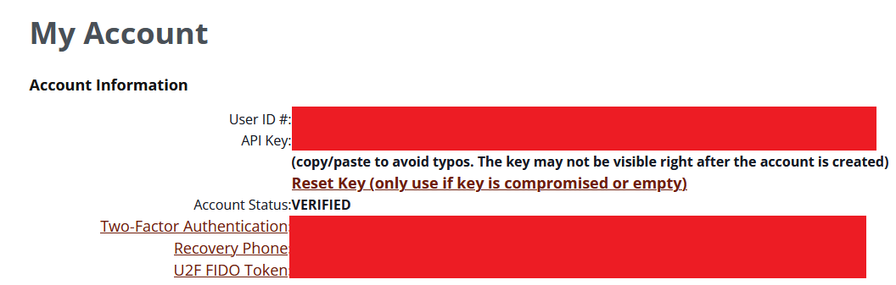

It's a little bit weird to get to, but you need to click on the actual "My Account" text in the top right.

### Updating the Pi

I'm working on setting up a dedicated patching day for all of my home servers, but for now I just periodically do it.  I'll likely get something setup with Ansible to handle it at some point.  Regardless, this particular device will be a high priority one for me to update due to the nature of what it's hosting.  

Before doing anything I ran the below commands to get everything up to date:

```bash
apt -y update
apt -uy dist-upgrade
```

I don't usually work with Debian/Ubuntu aside from my Proxmox machine, so I learned a bit about how apt works:

- "apt update" simply updates the package listing, it doesn't actually conduct any updates.
- "apt upgrade" will update the actual packages, however it will not change what is currently installed (e.g. it won't uninstall packages or install new dependencies).
- "apt dist-upgrade" does the same as upgrade, but will install new packages and uninstall unneeded ones.

Very different from the RHEL based method of updating, I don't think I'm a fan of it.  Here's a screenshot of the "apt -uy dist-upgrade" command running:

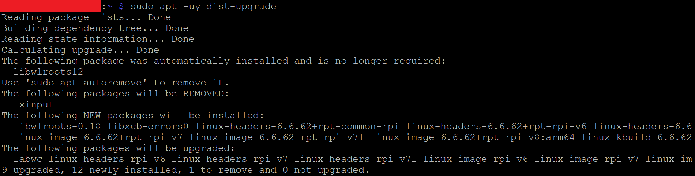

### Installing Dshield

Finally, with all of the setup out of the way, we can actually get to installing Dshield.  These steps will be abbreviated, I'm not a fan of blogs that just rehash what somebody else has said, I will however go over any difficulties I had, and how to get around them.

You begin by pulling the code from github and then running the install script.  The GUI that comes up with the install script is VERY finnicky, don't use tabs/shift-tabs to try to navigate through it, use arrow keys.  This particularly caused me a lot of headaches, I kept getting to a specific step and pressing tab which broke the install script requiring me to start over.

The second step will attempt to update packages, which we already did, but it's better to be safe than sorry:

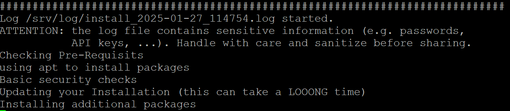

The installer will then provide some yes/no questions related to privacy, this is because the data you collect will be sent to the SANS ISC, so no worries there.  A second prompt will inform you about the potential security concerns with running a honeypot, if you've gotten this far you should already be aware:


Next up you have to authenticate your install using that account we setup earlier, just copy paste your API key and enter the email you used to setup your account:

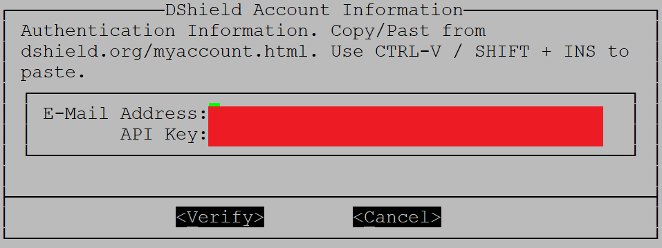

You then configure some network settings to help avoid logging info for any of your internal network devices:

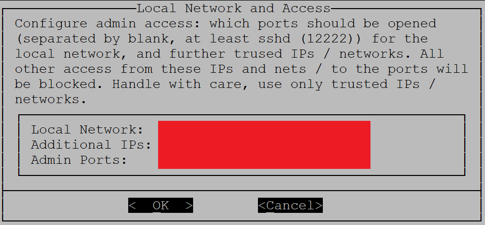

Then you setup an SSL cert to use for your honeypot web server, you can update this as you wish but I just kept the defaults.  Be careful with tabs here or you'll mess up your install.  This is what your screen will look like if you messed something up:

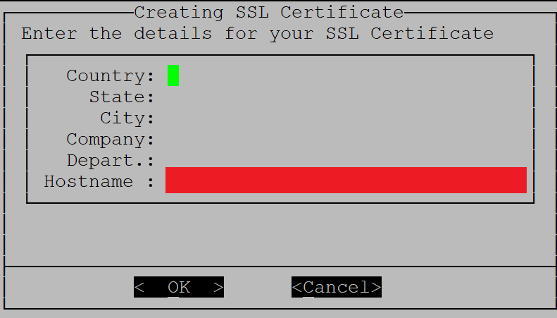

Important to note that somewhere in the install, the SSH port you'll need to use to connect is changed from 22 to 12222.  After the install is done, you can reboot your Pi and the Honeypot should be setup!  I say should be because I ran into problems here.

Once your server is back up, you can run the below command to check the status.  

```bash
sudo /srv/dshield/status.sh
```

Note that until you update settings in your router, you may see some red here like I have in the below screenshot.  This can also happen if you haven't delivered results to ISC yet, it usually takes an hour or two for that to happen:

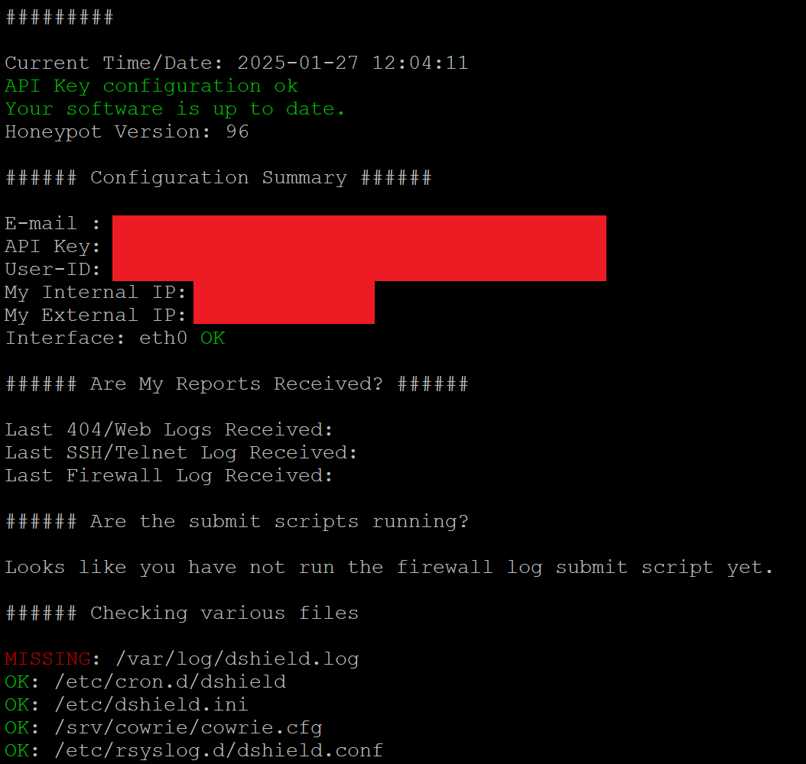

Now, if you messed up somewhere in the install, you have a couple of options.  I tried for several hours to fix the issue, but ultimately reinstalling Raspbian and reinstalling the DShield software is your best bet.  There are some uninstall steps listed on the DShield Github which you can try, but those didn't seem to work for me.

Regardless, once everything is installed correctly and data is being delivered to the ISC, you should see something like the below:

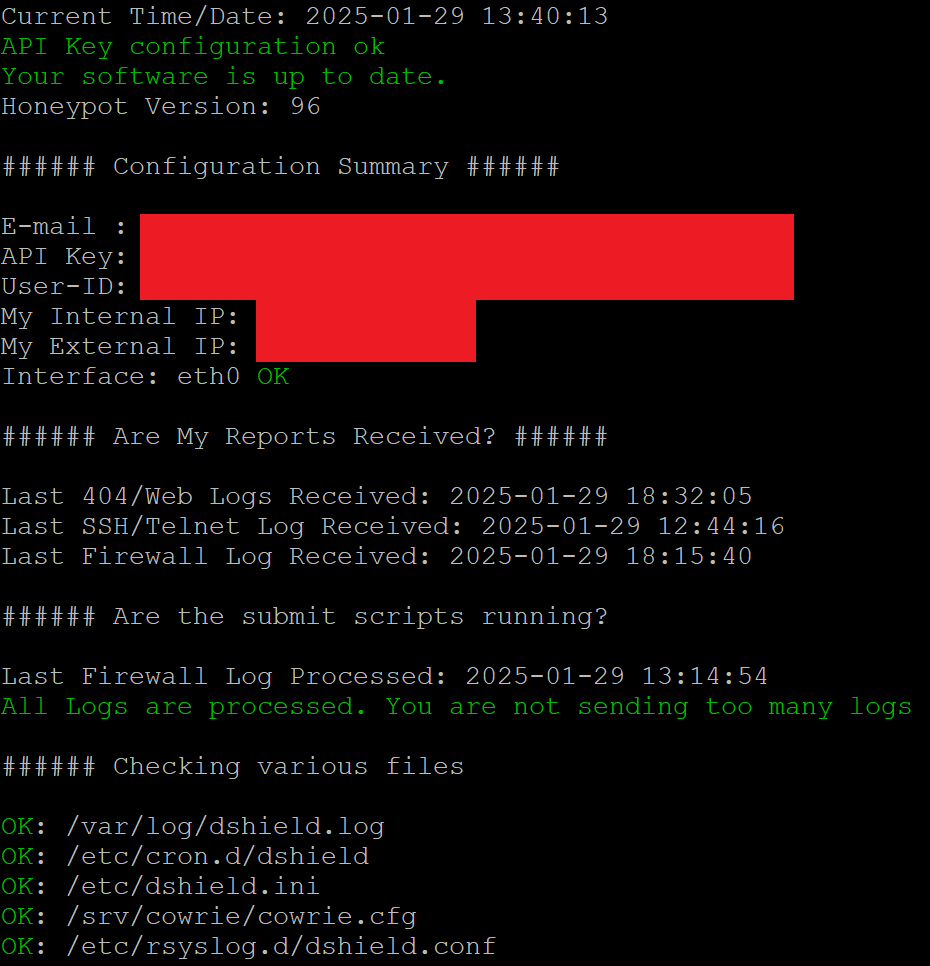

### Updating Your Router

Now for the sketchiest part, configuring your router to allow your honeypot to touch the Internet directly.  There's some debate here about the safety of this, my personal feelings are the 99% of attacks that will end up targeting your public IP address will be script kiddies or automated bots attempting to attack very specific vulnerabilities.  If, for whatever reason, an APT suddenly gets the urge to attack your home network, a honeypot isn't going to increase or decrease your risk of compromise at all.  

So, with that addressed, what should you do?  Each router is different, so you'll need to figure out the details on your own.  I won't provide screenshots here as that'll reveal a little too much info but here's the gist of what you need to do:

- Configure your router to use the Pi as a DMZ host.
- Configure your router to allow pings from the Public Internet (this step may or may not be necessary, but I figured I'd get better results if I kept it on).

Note that this is not a true DMZ, it is not logically separated from your home network.  This is a more simple method of forwarding all ports to another device, allowing the honeypot to see all traffic that's attempting to touch your home's public IP address.  

## All Done

With all of that out of the way, you officially have a honeypot running.  I'll be routing the logs to a log aggregator in a future blog post, but for now you can take a look at the results locally from the below log files, or you can see a slightly simplified version on the ISC website once your device starts delivering logs to them.

Below I go into a short analysis of one of the findings in the Firewall logs!

### Firewall Logs

You can find your honeypot's firewall log at /var/log/dshield.  You'll see lines for each individual connection a remote device makes to your public IP address as you can see below:

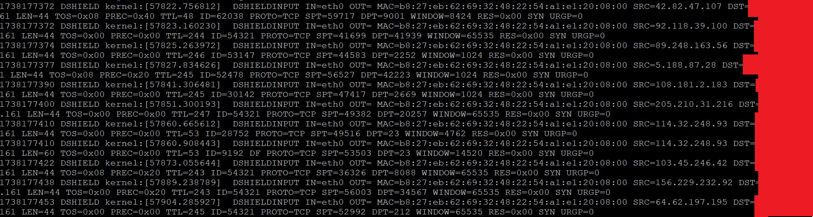

I'll go through one of these lines that I thought was interesting, note that I cut out some of the line to make it fit better on the page:

*MAC=b8:27:eb:62:69:32:48:22:54:a1:e1:20:08:00 SRC=114.32.248.93 LEN=44 PROTO=TCP SPT=49516 DPT=23 SYN*

#### MAC Address
We know the MAC address of the remote device which can give us the type of device that sent the packet: 

Each MAC address has an OUI (Organizationally Unique Identifier), each company that produces an Internet Connectable device is provided an OUI that makes up the first 3 bytes of a MAC address.  In this case, B8:27:eb indicates that the device on the other end is also a Raspberry Pi as shown from the lookup I did [here](https://macaddress.io/mac-address-lookup/x5Dpg6V056):

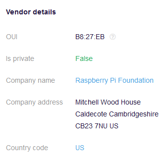

#### Source IP

We see that the source IP of this request was from 114.32.248.93.  We can check this IP on a few sites to get some info.

The first I'll do is just simply an IP Location lookup [here]https://whatismyipaddress.com/ip/114.32.248.93):

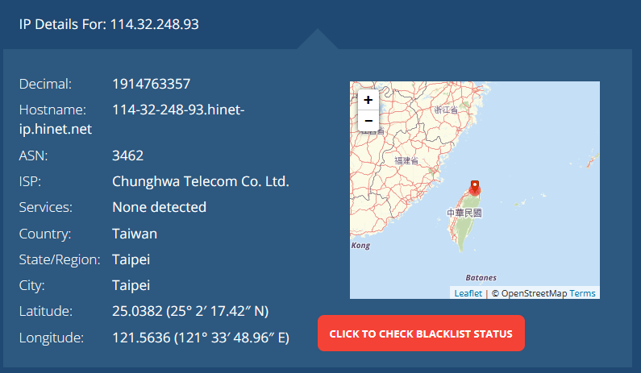

Well that's weird, why's there a Raspberry Pi in Taiwan connecting to my home router?

Ok, lets now check it on VirusTotal.  VirusTotal is a great website for checking if sites or IPs are malicious, you can find my lookup [here](https://www.virustotal.com/gui/ip-address/114.32.248.93):

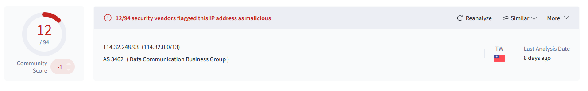

Sounds like the IP is probably malicious, likely a bot scanning for vulnerable systems to install malware on.

Note that both the IP address and the MAC address could very well be spoofed, so the usefulness of this info is negligible in the long run, interesting never the less!

#### Other Info

A few other things are useful.  Although not a complete packet capture, we can see the Length of the packet was 44 bytes, the Protocol used was TCP, the Destination Port was 23, and that it was a SYN packet.

So, this appears to have been a TCP packet attempting to initiate a connection on Port 23 (Telnet).  The SYN packet has a very standard length of 44 bytes.  If I had to guess, this is likely a scan of any Internet connected devices to see which ones respond to an attempted connection on Telnet's port.

I wouldn't be surprised to find this same IP somewhere in the other logs attempting to compromise the Honeypot's Telnet server.  

So much info off of just a single log line!

### Web Server Logs

I'll save a deep analysis of these logs for a future blog post, but you can find logs for attempted connections to your Honeypot's web server at /srv/db.  The files will be named "webhoneypot-YYYY-MM-DD.json".  These are of limited use due to readability unless imported into a log aggregator! Something I'll be doing in the near future.

### SSH/Telnet Logs

SSH/Telnet logs collected by Cowrie can be found here:  /srv/cowrie/var/log/cowrie.  There are normal text logs and json logs, both of which have already gathered a ton of info for me.  Again though, I'll save a deeper analysis of that data for a separate blog post!

## That's It!

Thanks for reading if you managed to get this far! I'm really excited to do more with this project and I'd really appreciate hearing feedback!  Feel free to connect with me on LinkedIn or send me an Email!

</div>

<div id="fun" style="display: none"> 

# Not This Time!

No fun article this time, I wrote up a lot for the Technical section and don't have time to write up something fun unfortunately.

</div>

<div id="simple" style="display: none"> 

# What is a Honeypot?

Gaining intelligence on potential bad guys and their actions is a really important thing when it comes to Cybersecurity.  This is referred to by a few different terms such as Threat Intelligence and Threat Hunting.  But how do you gather intelligence on new threats?

One way of doing this is to use a Honeypot, a host that's meant to look inviting to attackers that sits exposed on the Internet.  It's like a house with all it's doors and windows open inviting burglars in, only the house is a manufactured set with cameras all around it.  If there is a lock, thieves will find the lock is weirdly easy to pick, thieves would find expensive jewelry sitting out undefended in the open.

In the same way, honeypots are designed to let bad guys in.  Once they get inside, every action they take is recorded for analysis later.  In this way, the good guys are able to gather intelligence on up and coming attacks, to better prepare for the future.  

# What is a Raspberry Pi?

I chose to setup my Honeypot on a device called a Raspberry Pi (Pi from here on).  Pis are tiny computers with everything you need on a single small board to run an operating system.  At ~$35, you'd be hard pressed to find a better bang for your buck when it comes to small projects.  You can check out the Hardware section in the Technical article to see my buying guide, if your interested there are hundreds of guides that go over some really cool projects you can do with them.

# What's the point of your Honeypot?

Well I don't expect to catch any bad guys, this Honeypot is fairly simple and will only entice some of the automated bots that prowl the Internet.  It was, however, some really great experience!  I'll be writing posts in the future analyzing some of the attacks I'm seeing.

On top of that, all of the data I'm collecting is being sent over to a group called the Internet Storm Center, an offshoot of SANS that tasks itself with monitoring the Internet for new and concerning attacks.

One Honeypot isn't going to provide much information, but thousands spread across the globe can give a really good picture of the overall state of the Internet!  If a bunch of these devices in the US suddenly start seeing a new type of attack, it can be assumed that something new is going on and will warrant further investigation.

</div>