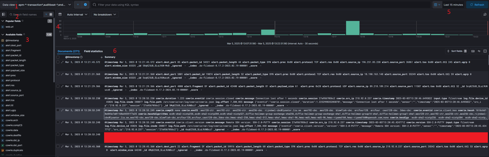

This post is going to be a long one, skip through sections about setup if you aren't interested and you can look at some of the analysis I did.

Pick from one of the three options above to view the different versions of the post!

<div id="technical" style="display: none"> 

# TECHNICAL

## Introduction

In my last blog post, [here](https://www.noah-rambles.com/posts/dshield-honeypot/), I went over how I set up the SANS ISC Dshield Honeypot.  The results were interesting, but I really wanted to feed the data into a log analysis platform which would allow me to do some more in depth analysis and aggregation.

This post will cover a few things:

  - Choosing a Log Aggregation Tool
  - Setting up the Chosen Tool
  - Integrating the Logs
  - Building Dashboards
  - Analyzing the Logs

If a particular topic doesn't interest you, feel free to skip over it! There were no guides I could find online for setting up Dshield logs to flow into a log aggregation tool, so I'll be going into some detail on the process in this post.

## Log Aggregation

Most people that have worked on computers know just how import logging is.  If it's not in your logs, it didn't happen!  You can't troubleshoot anything properly without some good logs to dig into.  Now what happens when you have ~13 million log entries that you need to parse through to find some info?

That's the situation I found myself in after just a few days of having my honeypot up.  On top of that, there are three different tools outputting logs to different locations that are all formatted differently.  The solution then is to utilize a log aggregation tool.  There's a few different options out there, I'll cover the below ones:

  - ELK Stack
  - Graylog
  - Splunk

Before going too far into this I should clarify what exactly I was looking for:

  - Free
  - Relatively Lightweight
  - Data Visualization
  - Data Aggregation/Parsing
  - Easy to Use

Anybody that's familiar with log analysis is probably yelling right now about Graylog, and that's what my first choice was.  For reasons I'll get into below, I ended up having to go with ELK.  With these requirements in mind, Splunk can immediately be dismissed as the free version of the software doesn't fit what I need.  I'll go into the details of the other two options below:

### ELK


ELK, or the ELK stack, is actually a combination of multiple tools that are used for data ingestion, manipulation, and display.  ELK stands for Elasticsearch, Logstash, and Kibana (usually you can add in Filebeat as well).  

Each of these tools are responsible for different things:

  - Filebeat:  Sends logs to an Elasticsearch or Logstash instance.
  - Logstash:  Ingests and processes log data before feeding it into Elasticsearch.
  - Elasticsearch:  A powerful "search engine" that can parse through massive amounts of log data.
  - Kibana:  A data visualization tool that acts as the front-end for Elasticsearch.

ELK is free and is back to being open source after a very disappointing move to closed source. I won't go into too much detail, but ELK was started as an open source project which allowed for transparency and a more community driven development process.  Some time ago Elastic decided to close source the project, this ended up fracturing the community which spread out to various other projects (e.g. graylog or opensearch).  As of ~6 months ago, Elastic has re-opened ELK to be open source.

They appear to be trying to ride the AI hype train as they rebrand into the "Search AI Company".  Open sourcing once more is likely a marketing ploy to try to draw back some of their lost customer base.

Shady business practices aside, I have used ELK in the past and am familiar with it, it also satisfies all of my requirements listed above.  I consider ELK to unfortunately be another victim of the gradual [Enshittification](https://en.wikipedia.org/wiki/Enshittification) of the Internet.

### Graylog


Graylog is another free and open source log aggregation platform.  It is purpose built specifically for logs, and struggles to handle other types of data (though that's not necessarily a bad thing!).  Graylog essentially replaces the Kibana and Logstash portions of the ELK stack, and requires a storage/indexing solution (either Elasticsearch or OpenSearch) to function.

It does simplify the stack slightly by reducing the overall scope of the tool and cutting out some of the requirements entirely.

Given Elastic's crummy business practices, and to do my part in support of the open Internet, I figured I'd go with Graylog!  A new tool to learn and add to my resume as well.

Unfortunately, after 6 or so hours of troubleshooting, I discovered that Graylog requires a CPU feature that really old CPU models do not have.  You can read a bit about it in [this](https://github.com/turnkeylinux/tracker/issues/1724) github issue.  Now, this is not specifically a Graylog issue, it's an issue with the backend database (MongoDB).  MongoDB ALSO seems to be going down an enshittification route by appealing towards big customers by cutting support for older hardware instead of supporting as much as possible.

My entire homelab is built off of a cheap old server I bought off of ebay, as that's what my budget allowed.  There are some instructions in the issue above for manually compiling a custom version of MongoDB, but frankly that's far more work than I'm willing to put in considering the developers made an active decision to drop support.

With that in mind, I grudgingly decided to utilize ELK.

## Design

Below you can find the general layout for my eventual setup:


So we have three sources of log data:

  - Cowrie:  SSH/Telnet Honeypot Logs
  - Firewall:  Port/IP Connection Logs
  - Web:  Web Server Honeypot Logs

I'll get into some more detail in a moment, but these three logs needed to be configured as sources in the filebeat process.  Filebeat will then parse the log data and deliver it to the Elasticsearch instance running on a VM I have hosted on my Proxmox server.  Kibana can then be configured to query the Elasticsearch data and give us some nice looking displays.

So, lets get into the log data...

### Cowrie Logs

Cowrie has a bit of a weird folder format, logs can be found at ***/srv/cowrie/var/log/cowrie***.

Within that folder there are two different formats to the logs, standard text output (found in the .log files), and json output (found in the .json files).  By default it appears to keep 8 days worth of logs before rotating them out, and rotates the current log file out daily, appending a date timestamp to the file.


Below you can see an example of a log line in the json cowrie logs.  The cowrie json logs vary wildly as each part of the session is logged on a new line (e.g. initial login, key exchange, commands, etc.).

***{"eventid":"cowrie.login.failed","username":"Nobody","password":"password321","message":"login attempt [Nobody/password321] failed","sensor":"","timestamp":"2025-03-05T12:23:21.555923Z","src_ip":"222.160.227.134","session":"75fe94d16d61"}***

And here's the text line for the same log output:

***2025-03-05T12:23:21.555923Z [HoneyPotSSHTransport,50,222.160.227.134] login attempt [b'Nobody'/b'password321'] failed***

The awesome thing about Filebeat is that it will automatically parse json output and split each individual item into it's own fields.  As we'll see in the next section, it is possible to parse text data, but it's painful and time consuming.  For that reason I chose to import the json cowrie log files.

### Firewall Logs

By far the trickiest part of this was getting the firewall logs to cooperate with filebeat.  The firewall logs are output in standard text format without a json output.  On top of that, the log lines differ wildly depending on the data.  The firewall logs can be found at ***/var/log*** and are named "dshield.log".  These logs appear to rotate out based on size, keeping 4 of them gzipped in the same folder before deleting them.  

Let's look at a few example log lines to see where the difficulties lie, note that I sanitized some of these lines:

***Standard TCP:***  
**1741196245 DSHIELD kernel:[52695.308941]  DSHIELDINPUT IN=eth0 OUT= MAC= SRC=148.113.206.49 DST= LEN=52 TOS=0x00 PREC=0x00 TTL=53 ID=9516 PROTO=TCP SPT=38339 DPT=8046 WINDOW=65535 RES=0x00 SYN URGP=0**

***Standard UDP:***  
**1741196176 DSHIELD kernel:[52626.786854]  DSHIELDINPUT IN=eth0 OUT= MAC= SRC=20.150.204.230 DST= LEN=88 TOS=0x00 PREC=0x00 TTL=242 ID=54321 PROTO=UDP SPT=43745 DPT=161 LEN=68**

***TCP With DF Flag Set:***  
**1741194791 DSHIELD kernel:[51241.632421]  DSHIELDINPUT IN=eth0 OUT= MAC= SRC=89.97.218.142 DST= LEN=60 TOS=0x00 PREC=0x00 TTL=52 ID=51046 DF PROTO=TCP SPT=48004 DPT=2222 WINDOW=29200 RES=0x00 SYN URGP=0**

Without getting too detailed, filebeat does not make it easy to parse text output when the length of the log lines changes.  You have to account for each individual variation or your results will be filled with errors.

### Web Logs

Luckily the web logs are similar to the cowrie logs in that they are output in json format.  The web logs can be found at ***/srv/db*** and are named "webhoneypot-YYYY-MM-DD.json".  It appears to rotate out log files daily, and keeps a total of 9 files saved before deletion.

Below you can see one of these log lines (again sanitized):

***{"time": "2025-03-05T01:25:57.676183", "headers": {"host": "XXXXXXXX:8000", "user-agent": "Mozilla/5.0 zgrab/0.x", "accept": "*/*", "accept-encoding": "gzip"}, "sip": "146.190.119.189", "dip": "XXXXXXX", "method": "GET", "url": "/aaa9", "data": null, "useragent": ["Mozilla/5.0 zgrab/0.x"], "version": "HTTP/1.1", "response_id": {"comment": null, "headers": {"Server": "Apache/3.2.3", "Access-Control-Allow-Origin": "*", "Content-Type": "text/html"}, "status_code": 200}, "signature_id": {"max_score": 72, "rules": [{"attribute": "method", "condition": "equals", "value": "GET", "score": 2, "required": false}, {"attribute": "headers", "condition": "absent", "value": "user-agents", "score": 70, "required": false}]}}***

One of the only issues I had here was that there wasn't an individual field for the port number.  You can see under "headers" there is a "host" field, this field contains both the destination IP and the port.  I had a surprisingly difficult time getting it to separate these, but I'll go over how I fixed that in a section below.

## Installation and Configuration

I'm not going to go into too much detail on installing the different components, there's plenty of guides out there that cover it already.  I will however go over some of the configuration I did to get it all working, primarily with the filebeat config.

### Filebeat Configuration

Filebeat's documentation is less than ideal with some information split between two different doc pages.  [This](https://www.elastic.co/guide/en/beats/filebeat/current/defining-processors.html) is the main one you'll need to be familiar with.

Essentially, filebeat has a number of "processors" that can pre-process your data in various ways before sending it over to Elasticsearch.  In the case of text data, this step is extremely important to make sure you don't just get a giant glob of data when browsing Kibana.

For each data source I set up a filebeat input, let's start with cowrie:
```
- type: filestream
  id: cowrie-logs
  enabled: true
  paths:
    - /srv/cowrie/var/log/cowrie/cowrie.json
  processors:
    - decode_json_fields:
        fields: ["message"]
        process_array: false
        max_depth: 2
        target: "cowrie"
        overwrite_keys: false
        add_error_key: true

    - drop_fields:
        fields: ["cowrie.sensor", "cowrie.langCS"]
```

I won't go too into detail, cowrie was definitely the easiest one to get setup.  More or less you just point the config to the log file, tell it to decode the json data, and then drop whatever fields you don't want.

Next up is the web log config (sanitized):

```
- type: filestream
  id: web-logs
  enabled: true
  paths:
    - /srv/db/webhoneypot-*.json
  processors:
    - decode_json_fields:
        fields: ["message"]
        process_array: true
        max_depth: 5
        target: "web"
        overwrite_keys: false
        add_error_key: true

    - if:
        contains:
          web.headers.host: ":"
      then:
        if:
          regexp:
            web.headers.host: '^.*:.*:.*$'
        then:
          - dissect:
              field: "web.headers.host"
              target_prefix: "web"
              tokenizer: '%{dest_ip}:%{}:%{dest_port}'
        else:
          - dissect:
              field: "web.headers.host"
              target_prefix: "web"
              tokenizer: '%{dest_ip}:%{dest_port}'
      else:
        - add_fields:
            target: "web"
            fields:
              "dest_ip": "XXX.XXX.XXX.XXX"
              "dest_port": "80"
```

This one's a bit more complicated.  Again we pointed it at the web logs, I used a wildcard character to make sure it picked up data from all log files regardless of the date.  The web logs were a bit more complicated so I had it parse json to a much greater depth of 5.

Now the complicated part, trying to separate the IP and port values in the web.headers.host section of the json.  As I said earlier, this field comes in a format like this:  ***XXX.XXX.XXX.XXX:PORT***.  I wanted to be able to filter by destination ports and such in Kibana, so I needed a processor that would separate the values in that field and create new values.

To further complicate matters, there were two weird edge cases in some of my data:

  - Double ports (e.g. ***XXX.XXX.XXX.XXX:PORT:PORT***)
  - No port (e.g. ***XXX.XXX.XXX.XXX***)

This meant that I would have to capture all three scenarios in the config to make sure there weren't any errors.  You can do this with if, then, else statements within the config as you can see above.

I first had an if statement that checked for a colon in the value.  If there was a colon there was a port attached.  If not, I set the dest_ip and dest_port values to a default of 80 (since 80 is the default web port).

I then used regex to have an additional if statement that checked for double colons.  Double colons indicate double ports, so the tokenizer will grab the second port and set the dest_port value to that.

Ok, lastly and most complicated is the firewall logs:

```
- type: filestream
  id: my-filestream-id
  enabled: true
  paths:
    - /var/log/dshield.log

  processors:
    - if:
        contains:
          message: "DF"
      then:
        if:
          contains:
            message: "UDP"
        then:
          - dissect:
              fields: ["message"]
              target_prefix: "alert"
              tokenizer: '%{} DSHIELD kernel:%{}  DSHIELDINPUT IN=eth0 OUT= MAC=%{} SRC=%{source_ip} DST=%{} LEN=%{packet_length} TOS=%{tos} PREC=%{prec} TTL=%{ttl} ID=%{packet_id} %{fragment} PROTO=%{protocol} SPT=%{source_port} DPT=%{dest_port} LEN=%{payload_size}'
        else:
          - dissect:
              fields: ["message"]
              target_prefix: "alert"
              tokenizer: '%{} DSHIELD kernel:%{}  DSHIELDINPUT IN=eth0 OUT= MAC=%{} SRC=%{source_ip} DST=%{} LEN=%{packet_length} TOS=%{tos} PREC=%{prec} TTL=%{ttl} ID=%{packet_id} %{fragment} PROTO=%{protocol} SPT=%{source_port} DPT=%{dest_port} WINDOW=%{window_size} RES=%{res} %{packet_type} URGP=%{ugrp}'

      else:
        if:
          contains:
            message: "UDP"
        then:
          - dissect:
              fields: ["message"]
              target_prefix: "alert"
              tokenizer: '%{} DSHIELD kernel:%{}  DSHIELDINPUT IN=eth0 OUT= MAC=%{} SRC=%{source_ip} DST=%{} LEN=%{packet_length} TOS=%{tos} PREC=%{prec} TTL=%{ttl} ID=%{packet_id} PROTO=%{protocol} SPT=%{source_port} DPT=%{dest_port} LEN=%{payload_size}'
        else:
          - dissect:
              fields: ["message"]
              target_prefix: "alert"
              tokenizer: '%{} DSHIELD kernel:%{}  DSHIELDINPUT IN=eth0 OUT= MAC=%{} SRC=%{source_ip} DST=%{} LEN=%{packet_length} TOS=%{tos} PREC=%{prec} TTL=%{ttl} ID=%{packet_id} PROTO=%{protocol} SPT=%{source_port} DPT=%{dest_port} WINDOW=%{window_size} RES=%{res} %{packet_type} URGP=%{ugrp}'
```

I won't get too into it, you should be able to understand what's going on above.  The tokenizer processor will allow you to create values from the text lines using variables defined by %{VARIABLE_NAME}.  You can skip certain portions by leaving the brackets empty (e.g. %{}).

The annoying thing is that your log lines have to be exactly the same every time with variable placement, or the line will fail to parse.  This means we have to account for each variation which means a ton of troubleshooting and if/else statements.  Eventually I got it all working and was pretty happy with the results.

Phew, ok that was a lot of info.  Let's get into the fun visual stuff!

## Kibana

The flexibility of Kibana is amazing, though it does take some getting used to.  I would recommend learning Elastic's version of SQL called ES|QL, it'll allow you to understand a bit more about how to manipulate data within Kibana.

Anyways, there are two main functions I'll be using within Kibana for now:  Dashboards and Discovery.

Discovery is essentially a way to manually sift through log data to look for interesting stuff.  It also really helps you to figure out what data would be useful to visualize.  At first glance it's completely overwhelming but I'll do my best to explain, take a look at the below screenshot:



So lets go over some of the stuff in the screenshot:

1. Data View:  You can adjust which data stream you want to view data from here.
2. Search: Use this constantly, it lets you parse through the hundreds of field names to find what your looking for.
3. Available Fields:  You can select these individually to display specific information that your looking for in the main window.
4. Graph: This shows you the rate at which your ingesting "documents", documents are Elasticsearch's way of referring to log lines.
5. Time Filter: You can use this to quickly filter based on time period.
6. Main Window: Here you can see all of your data, clicking opens up context menus that allow you to further filter your results.

Now that we've got that out of the way let's look at one of the configurations I have set up so we can see some actually useful info:


With a few simple filters on our data we have some actual actionable info!  Just from these few logs we can see some great info:

- The IP 130.185.101.86 attempted to login via SSH using the username Nobody and the password qwerty1234 (how original!) on port 2222.  
- 185.42.12.242 attempted a login with root/root123321 which also failed.

Well that's useful, but what about some nice visualizations?  Your in for a treat!

### Firewall Dashboard

I setup some nice dashboards for all three data sets, the first was firewall logs which you can see here:


So, the most basic log imaginable has provided some incredible info!  In under ~30 days, I've had over 600,000 attempts to access my honeypot from 64,000 unique IP addresses.  That's almost unbelievable but it's true!  The most common ports are as expected (aside from one that was surprising but cool!).

- 22: Default SSH port
- 2222: Common alternate SSH port.
- 23: Telnet port.
- 80: Default HTTP port.
- 8080: Common alternate HTTP port.
- 443: Default HTTPS port.
- 25565: Here's one weird one! This is the default port for Minecraft servers!
- 3389: Default RDP port.
- 5555: Another weird one, best I can tell this is the default port for something called Android Debug Bridge.
- 8443: Common alternate HTTPS port.

Really interesting info already!  The graph at the bottom also shows that we've had some weird results on some of these days, looks like there was a massive spike in UDP traffic on the 5th.

So from some very basic logging info we already have something actionable to look into, what in the world is up with all of that UDP traffic?  I'll get to that a little later, first let's take at the other dashboards.

### Cowrie Dashboard

Next up is the Cowrie dashboard! If you don't remember, cowrie hosts a fake Telnet/SSH honeypot that collects attempted login info and, if the capability is there, collects actual commands that logged in users run.  The dashboard is below, this one was quite a lot of work to get setup!


Unbelievably, there have been almost 250,000 different login attempts since I first got this setup a month ago.  43,000 different unique passwords have been used, 6,200 unique usernames, and 11,000 unique IP addresses.

The top 10's are pretty much as expected although it doesn't seem like telnet is working here for some reason...will need to look into that.  I was somewhat surprised that the most accessed port was 2222 instead of 22.  Usernames and passwords are probably ripped straight from top 10 lists out there as well.

I have a few tables to the side that show the most recent connections along with commands/usernames/passwords that were used, there's some interesting stuff in there too!

### Web Dashboard

Lastly we have the web dashboard.  The data was a bit different for this one so I tried out some alternative visualization methods.


You'll notice that both the Ports scanned and the records over time graphs are log scaled, this is to make sure that the smaller values weren't ignored (since the overwhelming number of web connections were attempted on port 80, all other values would have been tiny without log scaling).  

The enormous mountain on the 22nd on the bottom right graph is due to that being when I started feeding web data into ELK.  That's just a backlog of data and not a sudden burst of data.

Lastly, Kibana annoyingly covers up the bottom left value but the number is 12,396,650.  Over 12 MILLION individual web requests! That's insane.  Nearly 70% of those are from a single IP address as well.  

I also wanted to highlight some of the interesting values that the web requests can pickup such as cookie values.  Lastly, the "Top URLs" shows the top requested URLs in the web request.  Why would somebody request my site but then request some other weird random sites?  Your guess is as good as mine but I'll dive into that on a future blog post.

And with that I'm going to call it!  I would have loved to dive into some actual cases in this post but it's already far too long and far overdue.  Stay tuned though! More to come.

</div>

<div id="fun" style="display: none"> 

# Pretty Colors

Management bunch of cavemen? Unable read big word? Show pretty colors, get promotion.  ELK not animal, ELK sophisticated data ingestion software allowing for visualization of complicated datasets.

See below:


The end!

</div>

<div id="simple" style="display: none"> 

# Overwhelming Amounts of Logs

Log data is extremely important in IT.  Just about everything that happens on a computer will show up in a log somewhere.  A common saying in cybersecurity is "if there's no log, it didn't happen.".  

But log data can be overwhelming! When you have millions of lines of log data, how are you supposed to get anything useful out of it?

This is where log aggregation and ingestion software comes in.  It's entire job is to collect all of your logs, and help you interpret them in meaningful ways!

Elastic is one such platform that also adds on some cool visualization tools.

# Elastic Visualization


This is a Dashboard, something you can easily create in Elastic after you start ingesting data.  This particular data is related to the Firewall portion of my Honeypot and simply tracks the below information:

- Where the attacker is connecting from.
- When the attacker is connecting.
- What the attacker is connecting to.

The first pie chart shows the top 10 IP addresses that various attackers have connected from, the second shows what they are attempting to connect to.

The table shows the most recent connections, and the chart at the bottom shows the connections over time!

Even somebody unfamiliar with the world of IT can probably go through and pick out some interesting data here:

- There are 32,000 connecting IPs and the overwhelming majority of connections were made by just 10 of them.
- The two most common ports attacked are 2222 and 22.
- There has been a large uptick in connections over the past week.

Awesome! Now you can start asking questions:

- Why are those 10 IPs producing that much traffic?
- What runs on ports 22 and 2222 that would be of interest to hackers?
- Why has there been an uptick in the past week?

And suddenly you've got a whole career in data analysis!

</div>