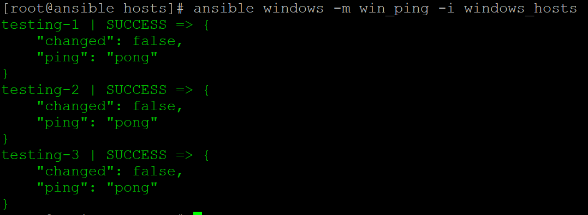
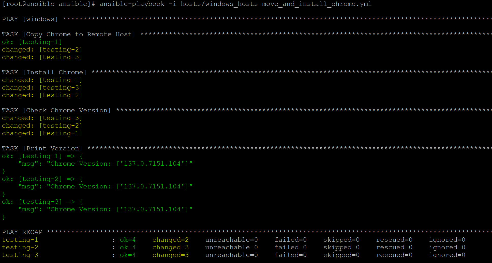
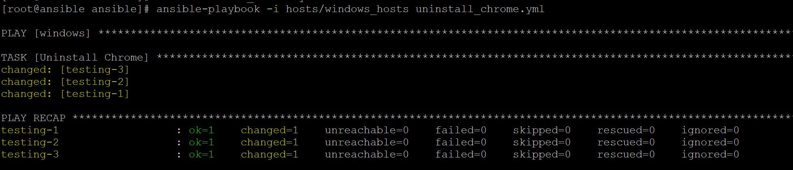

Shorter post this time just going over my attempt and eventual success at getting ansible to work properly with Windows.

Pick from one of the three options above to view the different versions of the post!

<div id="technical" style="display: none"> 

# TECHNICAL

## Introduction

I've used ansible in the past, it's a really cool tool that helps you to remotely manage a large number of remote Linux instances.  It's more or less essential in a modern-day Linux environment to properly manage patching and maintenance.  

What I didn't know is that you could actually use ansible to manage windows hosts too!  You can even use it to access powershell and run scripts, essentially allowing you to do whatever you want on the remote windows host!

This post is going to go over the setup process including some of the hurdles I had to overcome, as well as a couple of mistakes I came across in the official ansible documentation.

## Ansible

Let's briefly go over ansible and what it's used for.  Like I said above, ansible is used for remote management of devices.  

It operates on a sort of client-server relationship with a centralized ansible controller and remote ansible hosts.  Ansible is "agentless" in that you don't have to install any software on the remote hosts to get it to work, ansible authenticates via SSH to accomplish it's tasks and so works extremely well in a Linux environment.

You can set up an inventory .ini file like the below to help you track the devices in your environment:

``` yaml
[myhosts]
192.0.2.50
192.0.2.51
192.0.2.52
```

You can get really detailed with this inventory file, assigning different hosts to different tags so you can manage your inventory easily when running ansible playbooks.

Once you've got an inventory file setup, you need to setup authentication.  I won't go super in detail here about it but you can use a variety of different methods to do so.  Either way, ansible NEEDS to authenticate to the remote server to manage it.

Now you can actually go ahead and run some commands, the easiest is a ping command:

``` bash
ansible myhosts -m ping -i inventory.ini
```

The above command will read in the inventory file and run the ping plugin against any hosts matching the "myhosts" tag.  Ansible's ping is not a typical ping, it will fully authenticate to the remote server and make sure it can run commands before returning "pong".

### Playbooks

A key concept with ansible is the idea of a playbook, it's like a script that will be run through depending on the results of various different plugins.

For instance, you can run a playbook that will do the below:

- Connect to a host
- Check the hosts operating system
- If the host's operating system is Ubuntu, check the installed version of firefox
- If the Ubuntu host's firefox version is older than a needed version, update it
- Report all of the results

It's an extremely useful and dynamic tool for managing a large number of hosts and it's really only limited by the software installed on the remote hosts.

Below is an example playbook:

``` yaml
---
- name: Update web servers
  hosts: webservers
  remote_user: root

  tasks:
  - name: Ensure apache is at the latest version
    ansible.builtin.yum:
      name: httpd
      state: latest

  - name: Write the apache config file
    ansible.builtin.template:
      src: /srv/httpd.j2
      dest: /etc/httpd.conf

- name: Update db servers
  hosts: databases
  remote_user: root

  tasks:
  - name: Ensure postgresql is at the latest version
    ansible.builtin.yum:
      name: postgresql
      state: latest

  - name: Ensure that postgresql is started
    ansible.builtin.service:
      name: postgresql
      state: started
```

This playbook will run through two different plays:
- Check/update apache and then create an apache config template
- Check/update postgres and then start up postgres

## Remote Management of Windows

It's relatively simple to manage linux devices with ansible, it's mostly just a matter of setting up the inventory and authentication and your good to go.  Windows is an entirely different beast.  

Windows doesn't really have SSH built into it's core like Linux does, so we need to use an alternate method of reaching out and connecting.

There's a few different ways to do it, but the easiest by far is using Windows' built-in WinRM feature.  This allows for, you guessed it, remote management of windows devices.  So let's start there, we need to get winrm enabled on our remote hosts.

Before getting to that, a few fixes to issues I ran into:

- Make sure your internet connection is set to Private
- Make sure you have a hostname setup
- Disable your firewalls (optional)

You'll also want to add the hostname/ips of the windows devices to your /etc/hosts file on your ansible controller if you don't have DNS set up.

### Enabling WinRM

WinRM runs on an https port, allowing for authenticated and encrypted connections (though you can run it on an http port if you wish).  The difficulty here is that each host needs to have a cert set up to allow for the https server to work properly, so we'll need to create a self-signed cert on each server.

First though let's enable WinRM by running the below in an Administrator powershell:

``` powershell
Enable-PSRemoting -Force
```

#### Creating the Certificate

Now that WinRM is enabled, we can set up the port and certificate:

``` powershell
$certParams = @{
	CertStoreLocation = 'Cert:\LocalMachine\My'
	DnsName           = 'testing-1'
	NotAfter          = (Get-Date).AddYears(1)
	Provider          = 'Microsoft Software Key Storage Provider'
	Subject           = "CN=$env:COMPUTERNAME"
}
$cert = New-SelfSignedCertificate @certParams
```

The above commands will first initiate a variable to hold the location where the cert will be stored on the system, the hostname of the system the cert corresponds to, the length of time that the cert is valid, the "provider" of the certificate, and the subject that the cert corresponds to.
The last line will take the variable we created at the top and actually create the certificate.

#### Creating the Listener

We now need to configure winrm to listen for HTTPs connections:

``` powershell
$httpsParams = @{
    ResourceURI = 'winrm/config/listener'
    SelectorSet = @{
        Transport = "HTTPS"
        Address   = "*"
    }
    ValueSet = @{
        CertificateThumbprint = $cert.Thumbprint
        Enabled               = $true
    }
}
New-WSManInstance @httpsParams
```

The above commands utilize the cert we created earlier to set up the listener.

#### Configuring the Firewall

Now we need to open up the firewall on a port of our choice to allow for connections to WinRM:

``` powershell
$firewallParams = @{
    Action      = 'Allow'
    Description = 'Inbound rule for Windows Remote Management via WS-Management. [TCP 5986]'
    Direction   = 'Inbound'
    DisplayName = 'Windows Remote Management (HTTPS-In)'
    LocalPort   = 5986
    Profile     = 'Any'
    Protocol    = 'TCP'
}
New-NetFirewallRule @firewallParams
```

The above is mostly self-explanatory.  Adjust the port depending on what port you actually want winrm to listen on.

Now let's enable certificate auth on Windows:

``` powershell
Set-Item -Path WSMan:\localhost\Service\Auth\Certificate -Value $true
```

For whatever reason, the above commands created both an HTTP and an HTTPs listener, I didn't want the HTTP one so I used the below command to remove it:

``` powershell
get-childitem -Path WSMAN:\localhost\Listener | Where-Object Keys -contains "Transport=HTTP" |Remove-Item -Recurse -Force
```

### Configuring Ansible/Linux

We now need to do some work on the ansible host to get it setup to work with WinRM, below are the steps I followed to both get ansible installed on my Rocky 8 system, and configure it for WinRM:

``` bash
# Install the epel-release repo so we can install ansible
dnf install epel-release -y

# Install required software, rust and cargo are needed for the winrm pip module
dnf install rust ansible cargo -y

# Make sure pipe is upgraded
pip install --upgrade pip

# Install the required pip module
pip install pywinrm
```

That should be everything we need on the Linux side of things.  Next we need to generate the auth cert that we're going to use to reach out to the windows servers.

### Setting up the Authentication Certificate

It's far more secure to use certificate based authentication that password based, so let's go ahead and get that set up so we can associate our ansible user with a local admin user on the windows hosts:

Let's start by creating a local openssl.conf file to store some important config options in:

``` bash
cat > openssl.conf << EOL
distinguished_name = req_distinguished_name

[req_distinguished_name]
[v3_req_client]
extendedKeyUsage = clientAuth
subjectAltName = otherName:1.3.6.1.4.1.311.20.2.3;UTF8:${USERNAME}@localhost
EOL
```

I ran into trouble with the ansible documentation's provided commands at this point, the below commands worked for actually generating our certs.  Make sure to replace "ADMIN" with whatever username you are authenticating to on the remote windows host:

``` bash
openssl req -new -sha256 -subj "/CN=ADMIN" -newkey rsa:2048 -nodes -keyout cert.key -out cert.csr -config openssl.conf -reqexts v3_req_client

openssl x509 -req -in cert.csr -sha256 -out cert.pem -days 365 -extfile openssl.conf -extensions v3_req_client -signkey cert.key

rm openssl.conf cert.csr
```

Our cert and private key should now be generated!  It's now just a matter of moving over our cert to the windows hosts and associating it with the user we picked out.

#### Associating the Cert with a User

Back on our windows hosts let's run the below in our admin powershell console, adjust the commands based on where you moved your cert to:

``` powershell
$cert = [System.Security.Cryptography.X509Certificates.X509Certificate2]::new("C:\Users\Admin\Desktop\cert.pem")

$store = Get-Item -LiteralPath Cert:\LocalMachine\Root
$store.Open('ReadWrite')
$store.Add($cert)
$store.Dispose()
```

The above commands will read the certificate into the Windows store, we now need to actually associate it with a user.  Again make sure you adjust the commands to suit your environment:

``` powershell
$credential = Get-Credential ADMIN

$cert = [System.Security.Cryptography.X509Certificates.X509Certificate2]::new("C:\Users\Admin\Desktop\cert.pem")
$certChain = [System.Security.Cryptography.X509Certificates.X509Chain]::new()
[void]$certChain.Build($cert)
$caThumbprint = $certChain.ChainElements.Certificate[-1].Thumbprint

$certMapping = @{
    Path       = 'WSMan:\localhost\ClientCertificate'
    Subject    = $cert.GetNameInfo('UpnName', $false)
    Issuer     = $caThumbprint
    Credential = $credential
    Force      = $true
}
New-Item @certMapping
```

And we should now be all good to go!  Let's set up the ansible inventory and run some commands.

### Running Ansible

Below is the inventory file I set up for my hosts, the vars at the bottom are essential for making sure our commands use the proper method of authenticating, adjust them as needed:

``` yaml
[windows]
testing-1
testing-2
testing-3

[windows:vars]
ansible_connection=winrm
ansible_winrm_transport=certificate
ansible_winrm_cert_pem=/root/cert.pem
ansible_winrm_cert_key_pem=/root/cert.key
ansible_port=5986
ansible_winrm_scheme=https
ansible_winrm_server_cert_validation=ignore
```

Let's go ahead and now run a simple ansible command:

``` bash
ansible windows -m win_ping -i windows_hosts
```

And we get our output:



Awesome! WinRM is working!

Let's make a nice playbook to demonstrate.  The below playbook is responsible for logging into the system, moving over a google chrome installer, installing chrome, and then getting the chrome version:

``` yaml
---
- hosts: windows
  gather_facts: no
  tasks:
    - name: Copy Chrome to Remote Host
      ansible.windows.win_copy:
        src: /etc/ansible/software/chrome.msi
        dest: C:\

    - name: Install Chrome
      ansible.windows.win_package:
        path: C:\chrome.msi

    - name: Check Chrome Version
      ansible.windows.win_powershell:
        script: '(Get-Package -Name "Google Chrome").Version'
      register: chrome_ver

    - name: Print Version
      ansible.builtin.debug:
        msg: "Chrome Version: {{ chrome_ver.output }}"
```

And here's a screenshot of the run:



Fairly simple, I did however learn some very important things while setting this up though.  Ansible relies entirely on product IDs to determine software versions and what software is installed on the system.  If the product ID is not properly set in the registry, you'll have a really tough time finding the software you want to manage.

.exe installers usually will not register these keys in the registry, instead you need to find .msi installers which WILL generate those keys.  You can find the chrome .msi installer here:  https://chromeenterprise.google/download/

Let's now setup a playbook that will uninstall chrome:

``` yaml
---
- hosts: windows
  gather_facts: no
  tasks:
    - name: Uninstall Chrome
      ansible.windows.win_package:
        product_id: '{637DE894-ACF5-3AAA-96FC-A53FC9B1904B}'
        state: absent
```

That product key can be found within the registry here, after Chrome has been installed: 'HKLM:\Software\Wow6432Node\Microsoft\Windows\CurrentVersion\Uninstall'. 

Here's a screenshot of the uninstall playbook running:



### Conclusion

With the inclusion of modules like win_powershell and win_package, remote management of Windows is entirely possible.  With access to powershell, you can do essentially anything on the system.  Overall the setup for this is fairly tedious, and the actual management is a little more tricky than using a tool such as SCCM.  If your working in a medium size environment that's primarily Linux with a few Windows workstations, ansible is a perfectly reasonable route to go in terms of remote management.

</div>

<div id="fun" style="display: none"> 

# Not Today!

No fun page today, sorry! Maybe next time.

</div>

<div id="simple" style="display: none">

# Not Today!

No simple page today, sorry!  Maybe next time.

</div>